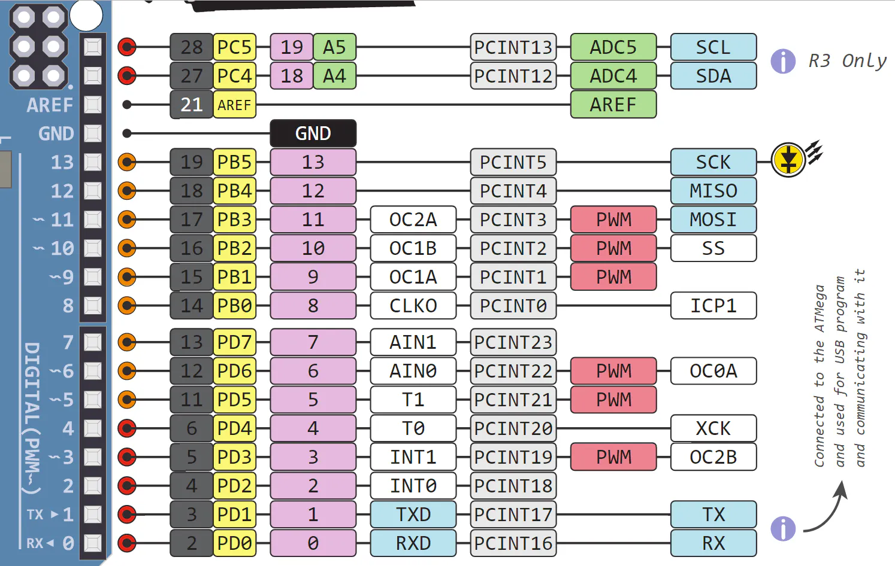
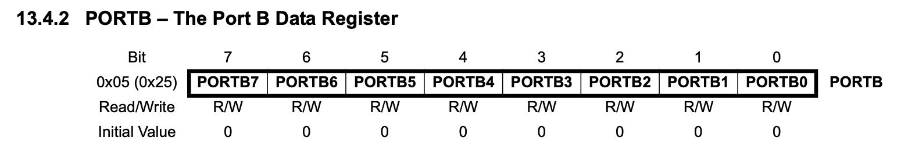
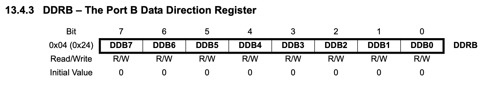

+++
title = "atmega328p blinky"
date = 2024-07-13T20:51:39Z
description = "Bare metal blinking of led in Arduino UNO (atmega328p)"
draft = false
toc = true
categories = ["bare-metal", "avr", "atmega328p"]
tags = ["avr"]
images = [
  "https://source.unsplash.com/collection/983219/1600x900"
] # overrides site-wide open graph image
[[copyright]]
  owner = "Sagar Ladla"
  date = "2024"
  license = "cc-by-nc-sa-4.0"
+++

# Intro
We are going to blink the on board led in Arduino UNO without any libraries. Understanding what is the actual code which is making the CPU to blink the led.

# Pin Description
atmega328p is 8-bit μc, that means it has 8-bit registers, 8-bit data bus, 8-bit cpu bus. It has 3 groups of GPIO registers namely PIN(B, C, D), DDR(B, C, D), PORT(B, C, D).

- PIN has the functionality of input
- DDR stands for Data Direction Register. It decides the flow of data, i.e., read(0) / write(1)
- PORT can be programmed either for data input (read) or data output (write) which is decided by DDR

On board led in Arduino UNO is present on pin 13,

which is 5th bit of PORTB with MMIO address of `0x25`.

For writing(1) to 5th bit of PORTB, we need enable the 5th bit of DDRB with MMIO address of `0x24`.


# Code Workflow
- Blinking can be performed with the simple bit-shifting, ```(1 << 5)```,
	1. write enabling DDRB: `DDRB = DDRB | (1 << 5)`
	2. writing logical high to PORTB: `PORTB = PORTB | (1 << 5)`
	3. delay
	4. writing logical low to PORTB: `PORTB = PORTB & ~(1 << 5)`
	5. delay

### Pseudo code
```c
#include<io.h>

int main(void)
{
	DDRB |= (1 << 5);
	volatile int i = 0;
	while(1)
	{
		for(i = 0; i < 25000; i++)
			PORTB |= (1 << 5);

		for(i = 0; i < 25000; i++)
			PORTB &= ~(1 << 5);
	}
	return 0;
}
```
MMIO addresses for DDRB and PORTB as shown above:
```c
#ifndef _IO_H_
#define _IO_H_

typedef unsigned char uint8_t;

#define DDRB (*(volatile uint8_t *)(0x24))
#define PORTB (*(volatile uint8_t *)(0x25))

#endif
```
Let us compile our code:
```Makefile
CC := avr-gcc
PLATFORM := atmega328p
CFLAGS := -nostdinc -fno-builtin -nostdlib \
	  -mmcu=$(PLATFORM) -DF_CPU=16000000UL -Os

all : led.hex

led.o : led.c io.h
	$(CC) $(CFLAGS) -c led.c io.h -I.

led.bin : led.o
	$(CC) $(CFLAGS) -o led.bin led.o

led.elf : led.o
	$(CC) $(CFLAGS) -o led.elf led.o

led.hex : led.bin
	avr-objcopy -O ihex -R .eeprom led.bin led.hex

burn:
	sudo avrdude -F -V -c arduino -p $(PLATFORM) \
	-P /dev/ttyACM0 -b 115200 -U flash:w:led.hex
```

### Flashing instructions
You can check to what port is your Arduino connected to: `$ ls /dev/ | grep ACM`

Execute `$ make` to prepare the flashable file(led.hex), and then flash using `$make burn` command.

### Demo
Yeaah! you have coded the bare-metal led blinking for atmega328P. You can substitute the pin13 with IO pin your choice together with external led.


Source: 
