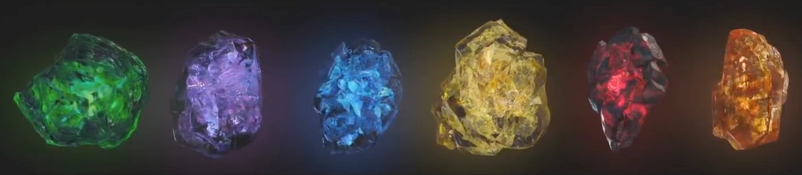
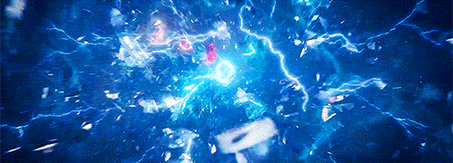

+++
title = "Infinity Saga"
date = 2025-06-21T21:16:58+05:30
description = "It contains the movies revolving around infinity stones."
draft = false
toc = false
categories = ["marvel-comics-universe"]
[[resources]]
  src = "./images/infinity-stones.gif"
  name = "header"
  title = "Infinity Stones"
  [resources.params.meta]
    description = "Infinity Stones"
    creator = "https://static.wikia.nocookie.net/marvelcinematicuniverse/images/1/1d/Infinity_Stones_VFX.png/revision/latest?cb=20190427010810"
[[copyright]]
  owner = "Sagar Ladla"
  date = "2025"
  license = "cc-by-nc-sa-4.0"
+++

### PHASE 1
ID | FILM                                | RELEASE DATE  
---|-------------------------------------|---------------
0  | Iron Man                            | 02 / 05 / 2008
1  | Iron Man 2                          | 07 / 05 / 2008
2  | The Incredible Hulk                 | 13 / 06 / 2008
3  | Thor                                | 06 / 05 / 2011
4  | Captain America: The First Avenger  | 22 / 07 / 2011
5  | Marvel's The Avengers               | 04 / 05 / 2012

### PHASE 2
ID | FILM                                | RELEASE DATE  
---|-------------------------------------|---------------
6  | Iron Man 3                          | 03 / 05 / 2013
7  | Thor: The Dark World                | 08 / 11 / 2013
8  | Captain America: The Winter Soldier | 04 / 04 / 2014
9  | Guardians of the Galaxy             | 01 / 08 / 2014
10 | Avengers: Age of Ultron             | 01 / 05 / 2015
11 | Ant-Man                             | 17 / 07 / 2015

### PHASE 3
ID | FILM                                | RELEASE DATE  
---|-------------------------------------|---------------
12 | Captain America: Civil War          | 06 / 05 / 2016
13 | Doctor Strange                      | 04 / 11 / 2016
14 | Guardians of the Galaxy Vol. 2      | 05 / 05 / 2017
15 | Spider-Man: Homecoming              | 07 / 07 / 2017
16 | Thor Ragnarok                       | 03 / 11 / 2017
17 | Black Panther                       | 16 / 02 / 2018
18 | Avengers: Infinity War              | 27 / 04 / 2018
19 | Ant-Man and the Wasp                | 06 / 07 / 2018
20 | Captain Marvel                      | 08 / 03 / 2019
21 | Avengers: Endgame                   | 26 / 04 / 2019
22 | Spider-Man: Far From Home           | 02 / 07 / 2019

### PHASE 4
ID | FILM                                        | RELEASE DATE  
---|---------------------------------------------|---------------
23 | Black Widow                                 | 07 / 05 / 2021
24 | Shang-Chi and the Legend of the Ten Rings   | 09 / 07 / 2021
25 | Eternals                                    | 05 / 11 / 2021
26 | Spider-Man: No Way Home                     | 17 / 12 / 2021
27 | Doctor Strange in the Multiverse of Madness | 25 / 03 / 2022
28 | Thor: Love and Thunder                      | 06 / 05 / 2022
29 | Black Panther II                            | 08 / 07 / 2022
30 | Captain Marvel 2                            | 11 / 11 / 2022
31 | Ant-Man and the Wasp: Qualtumania           | 2022
32 | Guardians of the Galaxy Vol. 3              | 2023
33 | Fantastic Four                              | TBA

<!--  -->

